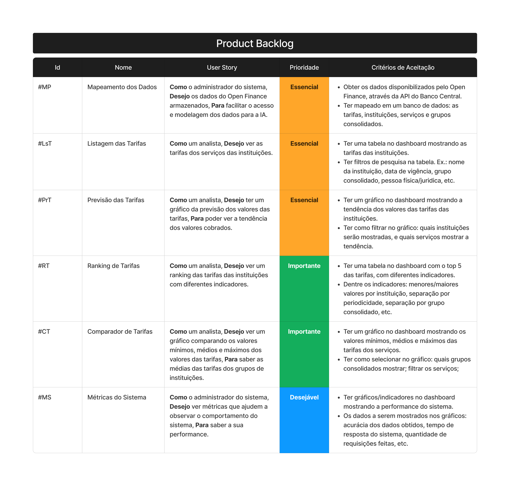

# Learning by Integrator Project

# Summary  
- [Introduction](#intro)
- - [Disciplines Integrated into the Project](#disciplines)
- - [Objective](#objective)
- - [Challenge](#challenge)
- - [Delivery Proposal](#proposal)
- [Documentation](#documentation)
- - [Product Backlog](#backlog)
- [Schedule](#schedule)
- [Technologies](#technologies)
- [Team Members](#members)

# Introduction 

Project developed by students of the sixth semester of the `Systems Analysis and Development` course at <a href="https://fatecsjc-prd.azurewebsites.net/">Fatec Prof. Jessen Vidal</a>, in São José dos Campos - SP, during the first half of 2023.
## 🎓 Disciplines Integrated into the Project 
- Artificial intelligence;
- Special Topics in Informatics;
- Team management.

## 🎯 Objective 
Monitoring system for services using Data Analysis with well-defined user profiles.

## ⏱️ Challenge 
Since 2020, the Central Bank of Brazil has been working to establish a new form of intercommunication among banks, companies, and clients, known as Open Finance Brazil. Traditionally, banks have always been huge vaults when it comes to storing their clients' data, but now there is a new paradigm that will generate endless possibilities for integration and the creation of new products and services. As a means of analyzing the fees charged for various services among participants in Open Finance, we face the challenge of presenting an intuitive and seamless price comparison tool based on the data made available by Open Finance.

## 📌Delivery Proposal 
Proposal for Delivery: Open Finance Data-driven Rate Comparison Tool.

Our proposal is to develop a tariff comparison tool that utilizes data provided by Open Finance. We will use the information provided by Open Finance to create a database that stores information about financial service rates. We will develop a classification panel that includes the following features: banks with the lowest and highest rates, a timeline showing the average tariff with a trend, the top 5 banks with the lowest rates within a given period. Additionally, we will create a tariff price comparator that includes the following criteria: products/services, banks, currency. In the comparator, we will display the institution and offer the lowest cost for the selected products/services.

# 📂 Documentation 

## Product Backlog 

 

# 📅 Schedule 

> Defined dates on sprint deliveries.

- [X] [KICK-OFF - 28/02/2023 ]

- [X] [SPRINT 1 - 13/03/2023 a 02/04/2023; - ](Refer%C3%AAncias/Documenta%C3%A7%C3%A3o/Sprint%201/)

- [X] [SPRINT 2 - 03/04/2023 a 23/04/2023; - ](Refer%C3%AAncias/Documenta%C3%A7%C3%A3o/Sprint%202/)

- [X] [SPRINT 3 - 24/04/2023 a 14/05/2023; - ](https://github.com/Sarah781/API-6-SeeTax/tree/main/Refer%C3%AAncias/Documenta%C3%A7%C3%A3o/Sprint%203)

- [ ] SPRINT 4 - 15/05/2023 a 04/06/2023;

- [ ] Solutions Fair and Final Presentation - 13/06/2023 e 14/06/2023.

# 💻 Technologies 

- 

    Used for web page prototyping.
    
    
- 
    
    Used for the Frontend of the page.
    
    
- 

- 

    Used for the Backend of the page.
    
-   
    Used for the bank.
    
    
# 👩‍💻 Team Members 👨‍💻 

[  Leonardo Ribeiro  <a href="https://www.linkedin.com/in/leonardo-gustavo-ribeiro-ba23831b6">Product Owner</a> ](https://github.com/Leo0256)   | [  Rita Ferreira  <a href="https://www.linkedin.com/in/rita-ferreira-894ba1200">Scrum Master</a> ](https://github.com/ritas2022)  | [  Sarah Santana  <a href="https://www.linkedin.com/in/sarah-santana-843394200">Dev Team</a>  ](https://github.com/Sarah781)   | [  Jonathan Gabriel <a href="https://www.linkedin.com/in/jonathan-gabriel-">Dev Team</a>  ](https://github.com/Jonathan-Assis)   | 
| :---: | :---: | :---: | :---: | 
[  Raul Iglesias  <a href="https://linkedin.com/in/raul-iglesias-8010201a1">Dev Team</a> ](https://github.com/RaulIglesias)  | 

[⬆ Back to the top](#top)

    
    

