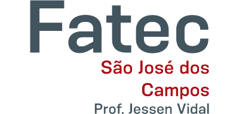

# Aprendizado por Projeto Integrador

# Sumário  
- [Introdução](#introducao)
- - [Disciplinas Integradas ao Projeto](#disciplinas)
- - [Objetivo](#objetivo)
- - [Desafio](#desafio)
- - [Proposta de Entrega](#proposta)
- [Documentação](#documentacao)
- - [Product Backlog](#backlog)
- [Cronograma](#cronograma)
- [Tecnologias](#tecnologias)
- [Integrantes da Equipe](#integrantes)
# Introdução 

Projeto desenvolvido por alunos do sexto semestre do curso de `Análise e Desenvolvimento de Sistemas` da <a href="https://fatecsjc-prd.azurewebsites.net/">Fatec Prof. Jessen Vidal</a>, em São José dos Campos - SP, durante o primeiro semestre do ano de 2023.
## 🎓 Disciplinas Integradas ao Projeto 
- Inteligência Artificial;
- Tópicos Especiais em informática;
- Gestão de Equipes;

## 🎯 Objetivo 
Sistema para acompanhamento de serviços utilizando Análise de Dados com perfis de usuários bem definidos

## ⏱️ Desafio 
Desde de2020, o Banco Central do Brasil vem trabalhando para estabelecer  uma nova forma de intercomunicação entre bancos, empresas e clientes; a plataforma batizada de Open Finance Brasil.Tradicionalmente,   os   bancos   sempre   foram   enormes   caixas-fortes   quando   se   tratam   do armazenamento dos dados de  seus clientes e, agora, há um novo paradigma que  gerará infinitas possibilidades de integrações e criação de novos produtos e serviços.Como forma de analisar os valores cobrados por diversos serviços entre os participantes do Open Finance, temos o desafio de apresentar de forma intuitiva e fluida, uma ferramenta de comparação de preços utilizando os dados fornecido através do Open Finance.

## 📌Proposta de Entrega 
Proposta de entrega: Ferramenta de Comparação de Tarifas utilizando dados do Open Finance

Nossa proposta consiste em desenvolver uma ferramenta de comparação de tarifas que utiliza os dados fornecidos pelo Open Finance. Nós utilizaremos as informações fornecidas pelo Open Finance para criar uma base de dados que armazene informações sobre as tarifas dos serviços financeiros. Iremos desenvolver um dashboard de rankings: Banco com menores, maiores tarifas; Linha do tempo da média de uma tarifa com tendência; Top 5 bancos com menores tarifas ao longo de um período; Desenvolver um comparador de preços de tarifas: Produtos/Serviços, Bancos, Moeda, e também no comparador, apresentar a instituição e oferecer o menor custo para os Produtos/Serviços selecionados.

# 📂 Documentação 

## Product Backlog 

 

# 📅 Cronograma de Entregas 

> Datas definidas sobre as entregas das sprints.

- [X] [KICK-OFF - 28/02/2023 ]

- [ ] [SPRINT 1 - 13/03/2023 a 02/04/2023]

- [ ] [SPRINT 2 - 03/04/2023 a 23/04/2023]

- [ ] [SPRINT 3 - 24/04/2023 a 14/05/2023]

- [ ] [SPRINT 4 - 15/05/2023 a 04/06/2023]

- [ ] [Feira de Soluções & Apresentação Final - 13/06/2023 e 14/06/2023]

# 💻 Tecnologias 

- 

    Utilizado para prototipagem da pagina Web.
    
    
- 
    
    Utilizado para o Frontend da página.
    
    
- 

- 

    Utilizado para o Backend da página.
    
    
# 👩‍💻 Integrantes da Equipe 👨‍💻 

[  Leonardo Ribeiro  <a href="https://www.linkedin.com/in/leonardo-gustavo-ribeiro-ba23831b6">Product Owner</a> ](https://github.com/Leo0256)   | [  Rita Ferreira  <a href="https://www.linkedin.com/in/rita-ferreira-894ba1200">Scrum Master</a> ](https://github.com/ritas2022)   | [  Sarah Santana  <a href="https://www.linkedin.com/in/sarah-santana-843394200">Dev Team</a>  ](https://github.com/Sarah781)   | [  Jonathan Gabriel <a href="https://www.linkedin.com/in/jonathan-gabriel-">Dev Team</a>  ](https://github.com/Jonathan-Assis)   | 
| :---: | :---: | :---: | :---: | 
[  Raul Iglesias  <a href="https://linkedin.com/in/raul-iglesias-8010201a1">Dev Team</a> ](https://github.com/RaulIglesias)   |[  Matheus Emboaba  <a href="https://www.linkedin.com/in/matheus-emboaba-a21970236">Dev Team</a> ](https://github.com/MatheusEmboabaTeteu)   | 

[⬆ Voltar ao topo](#topo)

    
    

