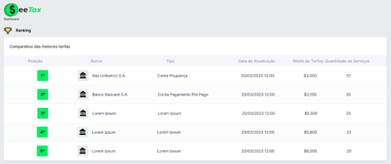
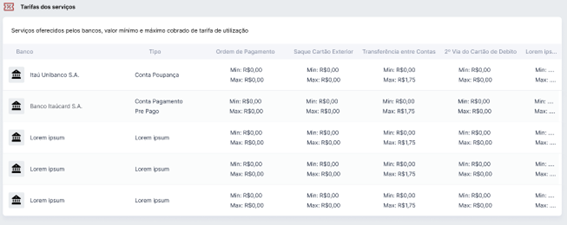

# Sprint 2

Entrega do dia 23/04/2023, tendo como base nos requerimentos da entrega:

- ## 📋 Sprint Backlog

A imagem abaixo descreve as Users Story do usuário entregues nesta sprint.

    

- ## 📊 Gráfico Burndown

O gráfico abaixo representa o desempenho da equipe com base no período de 03/04/2023 à 23/04/2023 na realização das tarefas atribuídas para a entrega.

- ## ✒️ Wireframe

<a href="https://www.figma.com/proto/2iz4Cag4lDaoAkmWGajaoD/SeeTax?node-id=302-988&scaling=scale-down-width&page-id=0%3A1&starting-point-node-id=302%3A988&show-proto-sidebar=1&hide-ui=1">Link do Play do protótipo Figma</a>

Os gifs abaixo é o protótipo das telas realizadas para a entrega da sprint.

    
    

- ## 🏷️Projeto 

